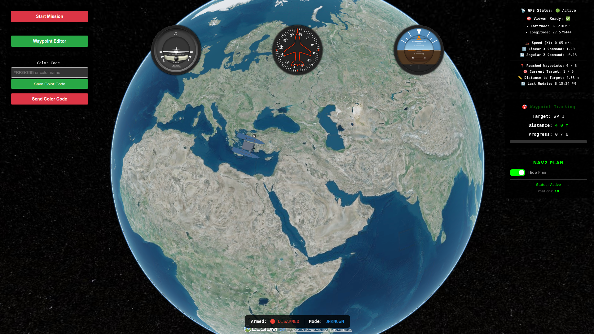
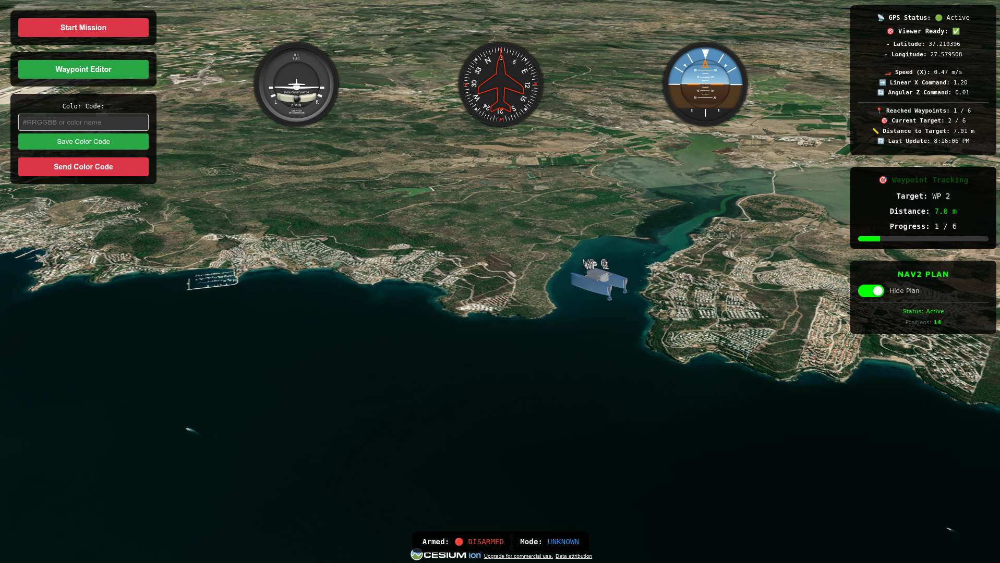
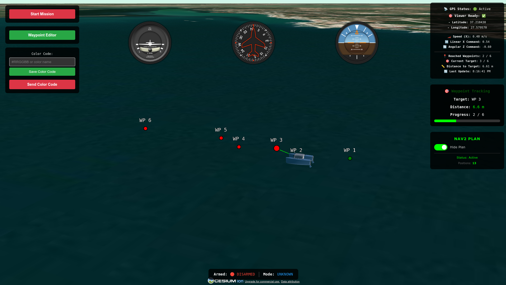

# GROUND CONTROL STATION

[](https://releases.ubuntu.com/22.04/)
[](https://docs.ros.org/en/humble/)
[](./LICENSE.txt)
[](https://fastapi.tiangolo.com/)
[")](https://www.uvicorn.org/)
[](https://www.electronjs.org/)
[](https://nodejs.org/)
[](https://cesium.com/cesiumjs/)
[](https://react.dev/)

This repository contains the core system, featuring an Electron-based desktop application designed for real-time data monitoring, waypoint management, and full mission control, all seamlessly visualized on an interactive 3D map.

<details>
<summary><strong>Project Structure</strong></summary>

```bash
.
├── backend/
│   ├── config/
│   │   ├── _init_.py
│   │   └── settings.py
│   ├── data/
│   │   ├── color_code.json
│   │   └── waypoints.json
│   ├── ros_nodes/
│   │   ├── color_code_publisher.py
│   │   └── waypoint_publisher.py
│   └── server/
│       ├── services/
│       │   ├── _init_.py
│       │   ├── config_service.py
│       │   ├── mission_service.py
│       │   └── storage_service.py
│       ├── api_server.py
│       ├── data_store.py
│       ├── main.py
│       └── ros_subscriber.py   
│
├── docs/
│   └── images/
│       ├── Ground_Control_Station_Image_v1.png
│       ├── Ground_Control_Station_Image_v2.png
│       └── Ground_Control_Station_Image_v3.png
│
├── src/
│   ├── main/
│   │   ├── app.controller.ts
│   │   ├── app.module.ts
│   │   ├── app.service.ts
│   │   └── index.ts
│   │
│   ├── preload/
│   │   ├── index.d.ts
│   │   └── index.ts
│   │
│   └── render/
│       ├── app/
│       │   ├── pages/
│       │   │   └── cesium_map/
│       │   │       ├── components/
│       │   │       │   ├── flight-indicator/
│       │   │       │   │   ├── flight_indicator.tsx
│       │   │       │   │   └── styles.css
│       │   │       │   ├── DebugPanel.css
│       │   │       │   ├── DebugPanel.tsx
│       │   │       │   ├── ExtraControls.css
│       │   │       │   ├── ExtraControls.tsx
│       │   │       │   ├── index.ts
│       │   │       │   ├── MissionControls.css
│       │   │       │   ├── MissionControls.tsx
│       │   │       │   ├── Nav2PlanControls.css
│       │   │       │   ├── Nav2PlanControls.tsx
│       │   │       │   ├── VehicleStatusIndicator.css
│       │   │       │   ├── VehicleStatusIndicator.tsx
│       │   │       │   ├── WaypointEditorTrigger.css
│       │   │       │   ├── WaypointEditorTrigger.tsx
│       │   │       │   ├── WaypointStatusPanel.css
│       │   │       │   └── WaypointStatusPanel.tsx
│       │   │       ├── constants/
│       │   │       │   ├── index.ts
│       │   │       │   └── waypoint.constants.ts
│       │   │       ├── hooks/
│       │   │       │   ├── useCesiumViewer.ts
│       │   │       │   ├── useMissionHandlers.ts
│       │   │       │   ├── useNav2PlanData.ts
│       │   │       │   ├── useNav2PlanVisualizer.ts
│       │   │       │   ├── useUSVData.ts
│       │   │       │   ├── useUSVModelUpdater.ts
│       │   │       │   ├── useWaypointTracker.ts
│       │   │       │   └── useWaypointVisualizer.ts
│       │   │       ├── service/
│       │   │       │   ├── baseService.ts
│       │   │       │   └── plane_service.tsx
│       │   │       ├── services/
│       │   │       │   ├── notification.service.tsx
│       │   │       │   ├── waypoint-animation.service.ts
│       │   │       │   ├── waypoint-entity-manager.service.ts
│       │   │       │   └── waypoint-visualizer.service.ts
│       │   │       ├── types/
│       │   │       │   ├── index.ts
│       │   │       │   └── waypoint.types.ts
│       │   │       ├── utils/
│       │   │       │   ├── errorHandler.ts
│       │   │       │   └── waypointParser.ts
│       │   │       ├── CesiumMap.css
│       │   │       ├── CesiumMap.tsx
│       │   │       ├── WaypointEditor.css
│       │   │       └── WaypointEditor.tsx
│       │   ├── store/
│       │   │   ├── editorSlice.ts
│       │   │   └── waypointsSlice.ts
│       │   └── store.tsx
│       │
│       ├── assets/
│       │   ├── models/
│       │   │   └── yildizusv.glb
│       │   └── globe1.PNG
│       │
│       ├── hooks/
│       │   └── HeadingIndicator_features.tsx
│       │
│       ├── App.css
│       ├── App.tsx
│       ├── index.html
│       ├── main.tsx
│       ├── models.d.ts
│       └── vite-env.d.ts
│
├── electron-builder.config.js
├── eslint.config.mjs
├── LICENSE.txt
├── logo.png
├── package.json
├── package-lock.json
├── README.md
├── renovate.json
├── requirements.txt
├── tsconfig.json
├── tsconfig.node.json
└── vite.config.mts
```

</details>

---


*Figure: A screenshot of the Ground Control Station interface showcasing the vehicle’s position and mission control elements on a 3D globe.*

---


*Figure: A screenshot of the Ground Control Station interface presenting the vessel’s position on the water, mission management controls, and detailed environmental 3D map elements from a dynamic viewpoint.*

---


*Figure: A screenshot of the Ground Control Station showing the vessel, annotated waypoints, and an active Nav2-derived path plan visualized on the 3D map.*

## DEPENDENCIES

Before proceeding, ensure the following are installed and configured:

* **Operating System:** [Ubuntu 22.04](https://releases.ubuntu.com/jammy/)
* **ROS 2:** [Humble Hawksbill](https://docs.ros.org/en/humble/Installation/Ubuntu-Install-Debs.html)
* **Node.js:** [Node.js v22.21.1](https://nodejs.org/en/download/) (recommended)

---

### Step 1 — Clone the repository:

```bash
git clone https://github.com/YILDIZ-USV/GROUND-CONTROL-STATION.git
cd GROUND-CONTROL-STATION 
```
---
### Step 2 — Install Frontend dependencies:

```bash 
# using npm (recommended)
npm install

# or using pnpm 
pnpm install
```
---
### Step 3 — Create the virtual environment:

```bash
python3 -m venv venv
source venv/bin/activate
```
---
### Step 4 — Install Python dependencies:

```bash
pip install -r requirements.txt
```
---
### Step 5 — Configure environment variables:

> **Note:** Get your Cesium Ion access token from [https://cesium.com/learn/ion/cesium-ion-access-tokens/](https://cesium.com/learn/ion/cesium-ion-access-tokens/) and set `VITE_CESIUM_ION_TOKEN=your_token_here` in `.env`.

```bash
cp .env.example .env
```

<details>
<summary><strong>Environment Variables</strong></summary>

| Variable                | Description                                      | Default     | Required? |
|-------------------------|--------------------------------------------------|-------------|-----------|
| HOST                  | Backend server bind IP (0.0.0.0 = all interfaces)| 0.0.0.0  | No       |
| PORT                  | Backend API/ROS server port                      | 5002     | No       |
| VITE_API_PORT         | Frontend API base port (constants.ts fallback)   | 5002     | No       |
| VITE_DEV_PORT         | Frontend development server port (Vite)          | 6001     | No       |
| VITE_CESIUM_ION_TOKEN | Cesium Ion token for 3D tiles/imagery            | None       | Yes      |

</details>

---
### Step 6 — Run the application:

```bash
# for npm
npm run start:all

# for pnpm
pnpm dev:full        
```

## API DOCUMENTATION

A concise listing of available ROS 2 topics and HTTP endpoints.

<details>
<summary><strong>ROS 2 Topics</strong></summary>

- `/imu/fixed_cov` - IMU data
- `/odometry/filtered` - Filtered odometry
- `/gps/fixed_cov` - GPS data
- `/cmd_vel` - Velocity commands
- `/plan` - Nav2 plan data
- `/color_code` - Color code
- `/waypoint` - Waypoint data

</details>

<details>
<summary><strong>Telemetry Data</strong></summary>

- `GET /api/gps_message` - GPS data
- `GET /api/imu_message` - IMU data
- `GET /api/linear_x` - Linear velocity
- `GET /api/angular_z` - Angular velocity
- `GET /api/odometry` - Odometry data
- `GET /api/all_telemetry` - All telemetry data

</details>

<details>
<summary><strong>Status Information</strong></summary>

- `GET /api/armed_status` - Armed status // Currently not in use, was used with Pixhawk
- `GET /api/mode_status` - Mode status // Currently not in use, was used with Pixhawk

</details>

<details>
<summary><strong>Mission Management</strong></summary>

- `POST /api/save_color_code` - Save color code
- `POST /api/save_waypoints` - Save waypoints
- `POST /api/run_mission` - Start mission
- `POST /api/run_mission2` - Start second mission

</details>

<details>
<summary><strong>Nav2 Plan</strong></summary>

- `GET /api/nav2_plan` - Nav2 plan data

</details>

## USAGE GUIDE

### Waypoint Management

- *Save before sending*: Waypoints must be saved before they can be sent to the mission.

- *Persistence*: Waypoints are stored in backend/data/waypoints.json and not cleared between sessions.

- *File upload*: You can upload waypoints from a TXT file.

- *Format*: One coordinate pair per line (latitude,longitude).

- Example:

        37.2103939,27.5794894

        37.2104271,27.5795765

### Color Code Configuration

- *Save before sending*: Color code must be saved before mission start.

- *Supported colors*: black, red, green (lowercase strings).

- *Persistence*: Stored in backend/data/color_code.json and retained between sessions.

- *Integration*: Seamlessly integrates with the [YILDIZ-USV](https://github.com/YILDIZ-USV/YILDIZ-USV) repository to provide complete autonomous surface vehicle capabilities.

## MAINTAINERS

* **Görkem Direybatoğulları** — GitHub: [@GorkemDireybatogullari](https://github.com/GorkemDireybatogullari)
* **Mustafa Berat Yavaş** — GitHub: [@MustafaBeratYavas](https://github.com/MustafaBeratYavas)
* **Muhammet Al** — GitHub: [@MuhammetAll](https://github.com/MuhammetAll)
* **Muhammed Kerem Demirbent** — GitHub: [@MuhammedKeremDemirbent](https://github.com/MuhammedKeremDemirbent)
* **Harun Kurt** — GitHub: [@harunkurtdev](https://github.com/harunkurtdev)

## ACKNOWLEDGMENTS


This project is built upon the open-source template [fast-vite-electron](https://github.com/ArcherGu/fast-vite-electron) by ArcherGu, which provides the foundational Electron, Vite, and React architecture. We extend our appreciation to ArcherGu for making this framework available.